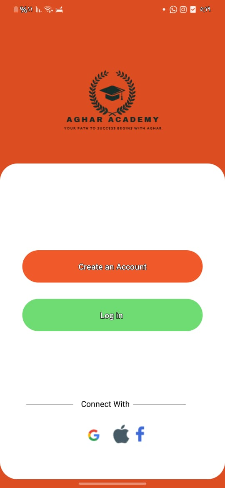
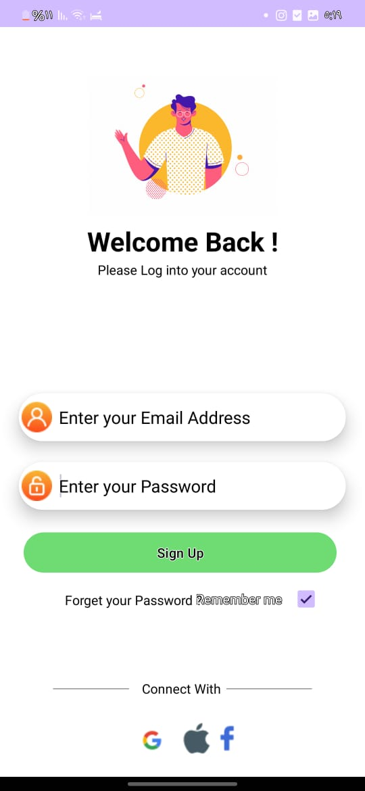
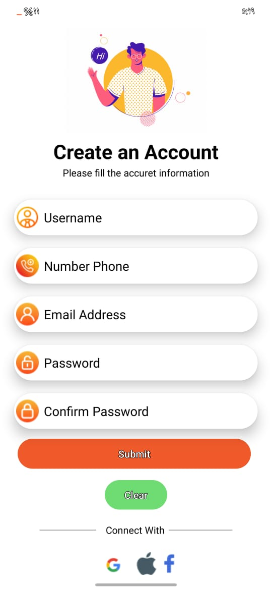
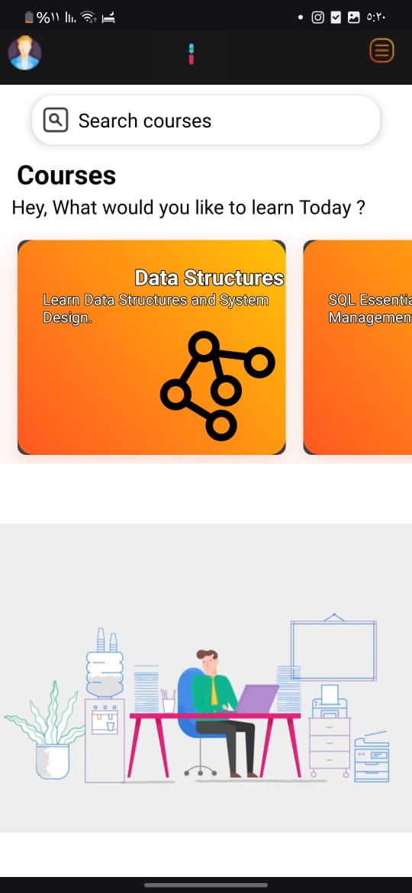
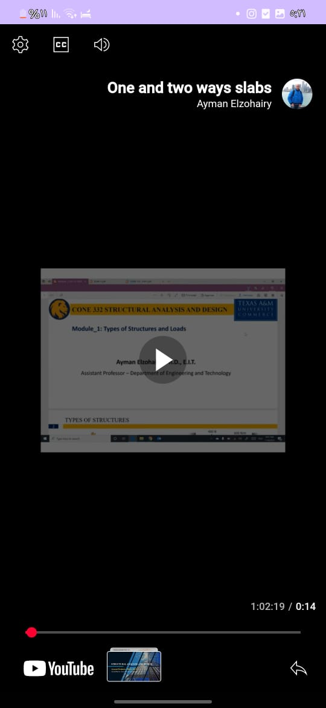
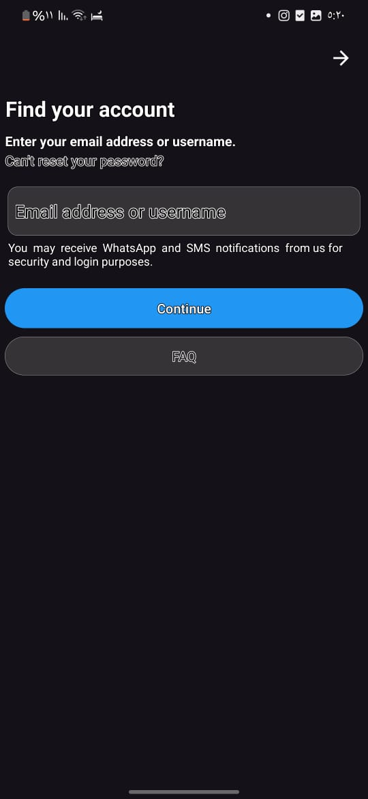

# SecureVideoCourseApp

An Android app for secure user authentication and YouTube-based video courses, with “Remember Me” support.

---

## 📂 Project Structure

MyProject/
├── pojo/
│ ├── Card_Information.java
│ └── video_card_information.java
├── ui/
│ ├── Forget_Password.java
│ ├── InterfacePresenter.java
│ ├── List_Lesson_Courses.java
│ ├── Login_Register.java
│ ├── LoginUser.java
│ ├── MainActivityApp.java
│ ├── RegisterUser.java
│ ├── Video_Activity.java
│ └── Forget_Password.java
├── DBManager.java
├── DatabaseHelper.java
├── ModelPresenter.java
├── Presenter.java
├── VideoStorage.java
└── AdapterMyCard.java

---
##  Architecture

This project is implemented using the **Model‑View‑Presenter (MVP)** pattern:
- **Model**: your POJOs and database helpers  
- **View**: Activities under `ui/`  
- **Presenter**: classes like `Presenter.java` and `ModelPresenter.java` handling all UI logic  

---
## ⭐ Features

1. **User Registration & Login**  
   - New users can sign up. Passwords are hashed with SHA-256 before storing in a local SQLite database.  
   - Login functionality verifies hashed credentials.

2. **“Remember Me” (Auto‑Login)**  
   - Optional “Remember Me” checkbox on the login screen.  
   - Uses `SharedPreferences` to keep the user logged in across app restarts.

3. **Course List**  
   - Displays a scrollable list of available courses.  
   - Each course card shows title, thumbnail and brief description.

4. **YouTube Video Playback**  
   - Tapping a lesson opens the YouTube video (either via YouTube Player API or external Intent).  
   - Video URLs are stored in the app’s data model.

5. **Security**  
   - Passwords saved only as SHA-256 hashes—original passwords cannot be recovered.  

---

## ⚙️ Requirements

- Android Studio (latest version)  
- Android SDK API Level 21 or higher  
- Internet connection for YouTube playback  

----
## 📸 App Screenshots













-----
## 🚀 Getting Started

1. **Clone the repo**  
   ```bash
   git clone https://github.com/AgharSukarieh/SecureVideoCourseApp.git
